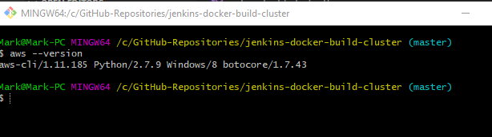
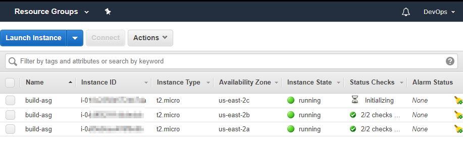
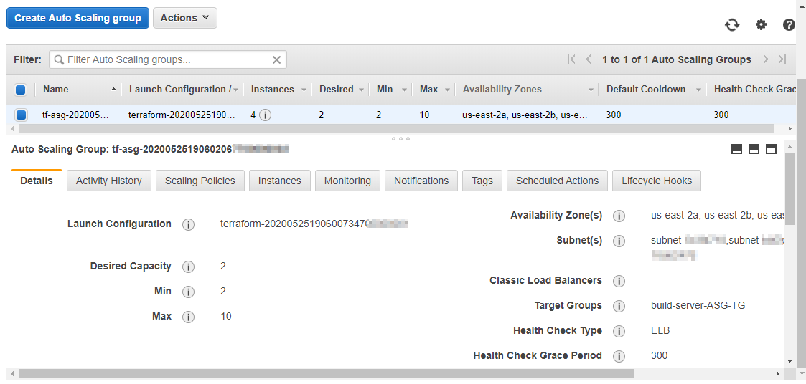
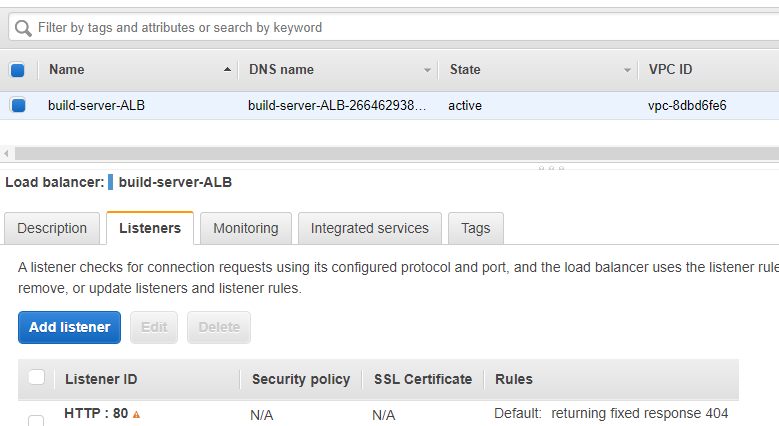
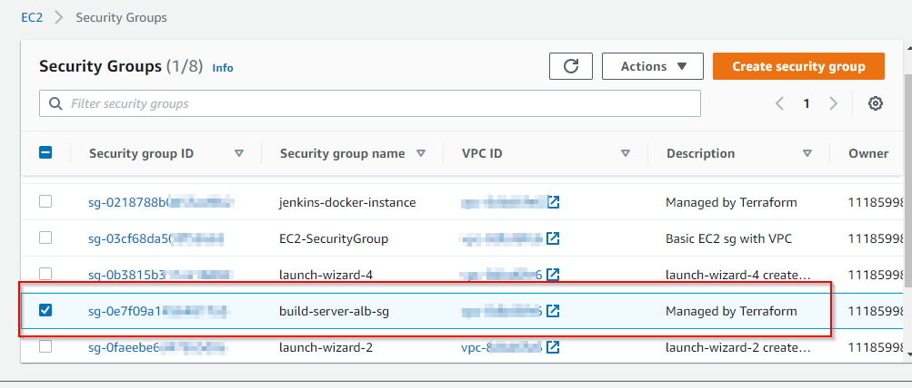

# jenkins-docker-build-cluster

## Purpose and Process

This project is a research use case to develop a uniform developer deployment instance of Jenkins and Docker running in in a Docker container

Why use docker to run Jenkins
A. Everyone will have the same container image of Jenkins
B. Operating system agnostic 
  -> Can run Docker on Ubuntu in Digital Ocean, AWS, Google Cloud, or Azure. 
  -> Can run locally on Mac, Windows, etc
C. Can easily upgrade Jenkins by pulling latest Docker Image and can modify the Jenkins container image by creating a Dockerfile

The purpose is to provide an automated environment for developers to deploy and test code that can be built in all environments including
Dev, Test, QA, and production (**CAUTION: This test package is not secure at this time and SHOULD NOT be used to deploy production grade code)

The concept is to have an automated package that can be deployed that standardizes the Jenkins and Docker versions and global tools across environments and platforms. Using a container, a developer or devops engineer can quickly deploy Jenkins and Docker on Windows, Linux, or MAC and have the same toolset to test code.

## Scalability

The concept of using Jenkins and Docker inside a container is useful for a single developer or scrum team.  In order for it to be a viable
option for entire teams or departments, it must be scalable to eliminate performance issues.  While the premise to keep this cloud, environment, and operating system agnostic, the project has been configured to deploy to AWS as an autoscale group.

The project uses several AWS tools including:
1. AWS Launch Configuration
2. AWS Autoscaling
3. AWS Load Balancing
4. Custom Security Groups
5. AWS VPC

The basic premise is the ASG is deployed with a minimum of two EC2 instances and can scale to a maximum of ten instances as demand increases. Please review jenkins_build_cluster.tf for more in depth details pertaining to the code used.

```
resource "aws_autoscaling_group" "buiLd-server-asg" {
    launch_configuration    = aws_launch_configuration.jenkinsdocker-asg.name
    vpc_zone_identifier     = data.aws_subnet_ids.default.ids

    target_group_arns       = [aws_lb_target_group.asg.arn]
    health_check_type       = "ELB"                         
    # Use type ELB rather than EC2. ELB uses the target group health check rather than AWS instance health check
    
    min_size = 2
    max_size = 10
```

## Deployment

Intial deployment to AWS can be done from the AWS-CLI command line tool.


 
Here we are using aws-cli version 1.1.185 to call "terraform apply" to build the jenkins-docker-build-cluster with the Terraform provider.aws version 2.63.0.  

Here are the expected resources after terraform apply completes.

1.  Launch Configuration createS EC2 instances, minimum of twol



2.  The jenkinsdocker autoscaling group is created.



3.  The build server load balancer and listener are created.  

 

4.  Finally the security group is created and the variables.tf is used for the aws_vpc and subnet id values. 
 
